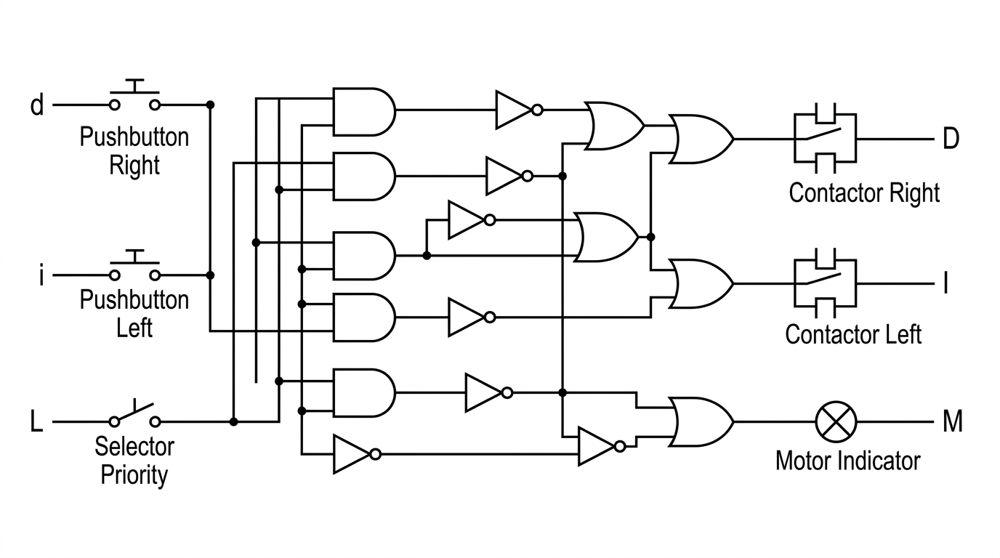

# Informe Técnico de Automatización: Banda Transportadora con Inversión de Giro
**Asignatura:** Automatización  
**Institución:** Fundación Escuela Tecnológica FET  
**Docente:** Ing. Jhon Marlon Perdomo Cortes  
**Ubicación del Proyecto:** `C:\Users\Carmelo\Documents\fet\ING LECTRICA FET ANTIGRAVITY`

---

## 1. Introducción y Planteamiento del Problema

El objetivo del proyecto es diseñar, analizar, validar y simular un sistema de control lógico combinacional para una **banda transportadora con inversión de giro**.

### Variables del Sistema:
* **Entradas:**
  * `d`: Pulsador de giro a la Derecha (1 = Presionado, 0 = Reposo).
  * `i`: Pulsador de giro a la Izquierda (1 = Presionado, 0 = Reposo).
  * `L`: Interruptor selector de prioridad (1 = ON / Activado, 0 = OFF / Reposo).
* **Salidas:**
  * `D`: Contactor de giro a la Derecha.
  * `I`: Contactor de giro a la Izquierda.
  * `M`: Estado del motor (1 = RUN / En movimiento, 0 = STOP / Apagado).

---

## 2. Condiciones de Funcionamiento (Premisa)

1. **Pulsación Individual:**
   * Si solo se pulsa `d` (`d=1, i=0`), el motor gira a la **Derecha** (`D=1, I=0, M=1`).
   * Si solo se pulsa `i` (`d=0, i=1`), el motor gira a la **Izquierda** (`D=0, I=1, M=1`).
2. **Pulsación Simultánea (Conflicto `d=1` e `i=1`):**
   * Si `L = 0` (en reposo) → El motor gira a la **Derecha** (`D=1, I=0, M=1`).
   * Si `L = 1` (activado) → El motor gira a la **Izquierda** (`D=0, I=1, M=1`).
3. **Reposo (`d=0` e `i=0`):**
   * El motor permanece **Apagado** (`D=0, I=0, M=0`).

---

## 3. Matriz de Análisis y Validación Estado por Estado

A continuación se presenta la tabla de verdad completa comparando la **Premisa del Proceso** contra las **Ecuaciones Dadas/Obtenidas**:

* **Ecuación Giro Derecha:** $D = d \cdot (\bar{i} + \bar{L}) = d \cdot \overline{(i \cdot L)}$
* **Ecuación Giro Izquierda:** $I = i \cdot (\bar{d} + L) = i \cdot \overline{(d \cdot \bar{L})}$
* **Estado Motor:** $M = D + I = d + i$

| State | $d$ | $i$ | $L$ | Premisa Esperada ($D, I, M$) | Ecuación $D = d(\bar{i}+\bar{L})$ | Ecuación $I = i(\bar{d}+L)$ | $M = D+I$ | Validación / Observación |
|:---:|:---:|:---:|:---:|:---:|:---:|:---:|:---:|:---|
| **0** | 0 | 0 | 0 | **(0, 0, 0)** | 0 | 0 | 0 | **CUMPLE** (Apagado) |
| **1** | 0 | 0 | 1 | **(0, 0, 0)** | 0 | 0 | 0 | **CUMPLE** (Apagado) |
| **2** | 1 | 0 | 0 | **(1, 0, 1)** | 1 | 0 | 1 | **CUMPLE** (Giro Derecha) |
| **3** | 1 | 0 | 1 | **(1, 0, 1)** | 1 | 0 | 1 | **CUMPLE** (Giro Derecha) |
| **4** | 0 | 1 | 0 | **(0, 1, 1)** | 0 | 1 | 1 | **CUMPLE** (Giro Izquierda) |
| **5** | 0 | 1 | 1 | **(0, 1, 1)** | 0 | 1 | 1 | **CUMPLE** (Giro Izquierda) |
| **6** | 1 | 1 | 0 | **(1, 0, 1)** | 1 | 0 | 1 | **CUMPLE** (Prioridad $L=0 	o$ Derecha) |
| **7** | 1 | 1 | 1 | **(0, 1, 1)** | 0 | 1 | 1 | **CUMPLE** (Prioridad $L=1 	o$ Izquierda) |

### Observación Crítica sobre las Ecuaciones:
* **Validación de Coincidencia:** Las ecuaciones simplificadas $D = d \cdot (\bar{i} + \bar{L})$ e $I = i \cdot (\bar{d} + L)$ cumplen al 100% con la premisa en los 8 estados posibles.
* **Nota si $L$ no estuviera invertido en $D$:** Si en una versión preliminar de ecuación se omite la inversión del selector en $D$ (ej. $D = d \cdot (\bar{i} + L)$), en los estados **6 (1,1,0)** y **7 (1,1,1)** la prioridad se invierte erróneamente, fallando la premisa del cliente/diseño.

---

## 4. Diagrama Esquemático de Compuertas Lógicas

### **Conexión en FluidSIM (Módulo Digital):**
1. **Salida Derecha ($D$):**
   * Compuerta `AND_1` con entradas `i` y `L`.
   * Inversor `NOT_1` a la salida de `AND_1`.
   * Compuerta `AND_2` con entradas `d` y salida de `NOT_1`. $	o$ Conectar a **$D$**.
2. **Salida Izquierda ($I$):**
   * Inversor `NOT_2` para la entrada `L` (obtiene $\bar{L}$).
   * Compuerta `AND_3` con entradas `d` y la salida de `NOT_2`.
   * Inversor `NOT_3` a la salida de `AND_3`.
   * Compuerta `AND_4` con entradas `i` y salida de `NOT_3`. $	o$ Conectar a **$I$**.
3. **Estado Motor ($M$):**
   * Compuerta `OR` entre las salidas $D$ e $I$. $	o$ Conectar a la lámpara **$M$**.

---

## 5. Diseño Electroneumático en FluidSIM (24V DC / Relés)

### Componentes en FluidSIM:
* **Alimentación:** `24V` y `0V`.
* **Pulsadores / Selecciones:** `d` (NA), `i` (NA), `L` (Selector).
* **Relés e Interbloqueos:**
  * Relé **`D`** (Giro Derecha) con contacto NC de interbloqueo de `I`.
  * Relé **`I`** (Giro Izquierda) con contacto NC de interbloqueo de `D`.
* **Actuador Neumático:**
  * Cilindro de Doble Efecto.
  * Válvula 5/2 biestable con solenoides `Y1` (Giro Derecha) e `Y2` (Giro Izquierda).

---

## 6. Archivos Generados en este Proyecto

* 📄 `Informe_Tecnico_Banda_Transportadora.md` (Este documento).
* 🖼️ `Esquematico_Compuertas_Logicas.jpg` (Esquema gráfico de compuertas).
* ⚙️ `BANDA TRANSPORTADORA.ct` (Circuito simulable en Festo FluidSIM).
